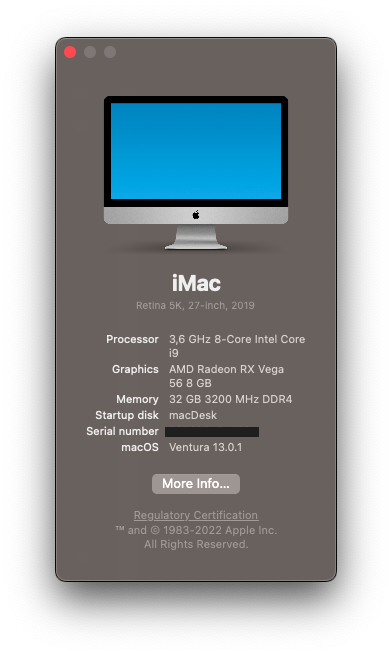
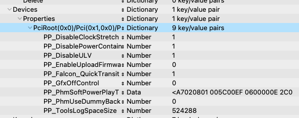
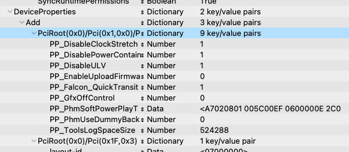

# macDesk
SFF Hackintosh, used as my main workstation at home. Assembled in Oct/2020. Always evolving.... A work in progress...

Guide used: https://dortania.github.io/OpenCore-Install-Guide/prerequisites.html#getting-started-with-opencore

***

## Hardware

- CPU: Intel I9-9900K
- GPU: Sapphire Pulse Radeon RX Vega 56
- RAM: Patriot Viper Steel DDR4 32GB (2 x 16GB) 3200MHz
- Motherboard: ASUS ROG STRIX Z390-I GAMING
- Audio codec: ALCS1220A (onboard)
- Ethernet: Intel I219V (onboard)
- WiFi/BT: BCM94360NG NGFF M.2 2230 WiFi Card (replaced onboard card)
- M.2 Drive: ADATA XPG SX8200 Pro 2TB
- HDD: Western Digital Black 4TB
- SSD: Intel SSD 480GB + Samsung 840 Pro 512GB (RAID1 1TB)
- CPU Cooler: Corsair iCUE H100i RGB PRO XT (replaced fans with 2 X Noctua NF-F12 PWM Chromax Black, much quieter now)
- Case fan: Noctua NF-S12A PWM Chromax Black
- Chassis: Sliger SM570
- PSU: Corsair SF750, 750 Watt Platinum 80+

***

## Software

- BIOS: 3004
- Boot loader: Opencore 0.8.1
- Operating system: macOS Monterey 12.4

### Tools

- MountEFI: https://github.com/corpnewt/MountEFI
- ProperTree: https://github.com/corpnewt/ProperTree
- USBMap: https://github.com/corpnewt/USBMap
- GenSMBIOS: https://github.com/corpnewt/GenSMBIOS
- OCConfigCompare: https://github.com/corpnewt/OCConfigCompare
- Hackintool: https://github.com/headkaze/Hackintool
- VGTab: https://www.tonymacx86.com/threads/tool-vgtab-control-your-vega-in-macos-without-flashing-the-vbios.268965/
- VGTabMerge: https://github.com/corpnewt/VGTabMerge
- liquidctl: https://github.com/liquidctl/liquidctl

***

## Drivers

- AudioDxe.efi
- HfsPlus.efi
- OpenCanopy.efi
- OpenRuntime.efi

***

## ACPI

- SSDT-AWAC.aml
- SSDT-EC-USBX.aml
- SSDT-PLUG.aml
- SSDT-PMC.aml
- SSDT-SBUS-MCHC.aml
- SSDT-UIAC.aml

***

## Kexts

- Lilu.kext
- VirtualSMC.kext
- WhateverGreen.kext
- AppleALC.kext
- IntelMausi.kext
- SMCProcessor.kext
- SMCSuperIO.kext
- USBInjectAll.kext (only to generate USBPorts.kext)

### System specific

- USBPorts.kext

### USB Port Mapping

Selected XHC ports:

| **Name** | **Port** | **Connector** | **Comment** |
| :---: | :---: | :--- | :--- |
| HS05 | 0x05 | 0: USB2 | Back - Left - #1 (black) - USB2 only |
| HS06 | 0x06 | 0: USB2 | Back - Left - #2 (black) - USB2 only |
| HS07 | 0x07 | 3: USB3 | Back - Left - #3 (blue) - USB2 personality |
| HS08 | 0x08 | 3: USB3 | Back - Left - #4 (blue) - USB2 personality |
| HS09 | 0x09 | 3: USB3 | Mainboard (Front) - USB2 personality |
| HS11 | 0x0B | 0: USB2 | Motherboard (H100i) |
| HS13 | 0x0D | 0: USB2 | Motherboard (Aura) |
| HS14 | 0x0E | 255: Internal | Bluetooth |
| SS01 | 0x11 | 9: TypeC+Sw | Front USB Type-C |
| SS02 | 0x12 | 9: TypeC+Sw | Back USB Type-C |
| SS03 | 0x13 | 3: USB3 | Rear USB 3.1 Gen 2 Type-A (Red) |
| SS04 | 0x14 | 3: USB3 | Rear USB 3.1 Gen 2 Type-A (Red) |
| SS07 | 0x17 | 3: USB3 | Rear USB 3.1 Gen 1 (Blue) |
| SS08 | 0x18 | 3: USB3 | Rear USB 3.1 Gen 1 (Blue) |
| SS09 | 0x19 | 3: USB3 | Front USB 3.1 Gen 1 (Blue) |

### About VGTab

This nice little tool creates a "SoftPowerPlayTable" that sets your Vega video card parameters to your preference (voltage, clock speed, etc.). I use it to undervolt and overclock my Vega 56 card. It generates a VGTab.kext in your desktop which is used by VGTabMerge to copy those parameters to your config.plist. The merge tool, which was made with CLOVER in mind, will inject the parameters to the subtree relevant to Clover. You must then move them to the appropriate subtree for Opencore. You have to move the "Devices->Properties->PciRoot(...)" child to "Device->Properties->Add" Dictionary. The remaining "Devices" subtree can then be deleted. This can be seen in the following two screen shots (the entry is highlighted in light blue):

**From here:**

>

**To here:**

>

***

## Working

- Ethernet
- WiFi & Bluetooth
- Audio: All the connectors are correctly identified and work as expected
- Graphics acceleration
- Messages
- Facetime (audio only, don't have a web cam)
- Continuity: 
	- AirDrop
	- Continuity Camera
	- Continuity Sketch
	- Continuity Markup
	- Handoff
	- Instant Hotspot
	- iPhone Cellular Calls
	- Text Message Forwarding
	- Universal Clipboard
	- Untested but should work just fine:
		- Apple Pay (N/A)
		- Auto Unlock (don't have an Apple Watch)
		- Sidecar (my iPad is too old)

***

## To do

- Sleep: Wakes inmediately after sleep. This happens when the usb port in which the liquid cooler is connected is mapped in USBPorts.kext. If I remove the port mapping then sleep/wake works as expected. This is a problem because I use "liquidctl" to configure the fan speed curve and I need the port active. The machine does the ocassional bittorrent, so I can live with it being always awake. Any other solution will be considered.

***

## Acknowledgment

A big thank you to those who spend time coding, documenting or testing these tools. Their effort is really appreciated...

